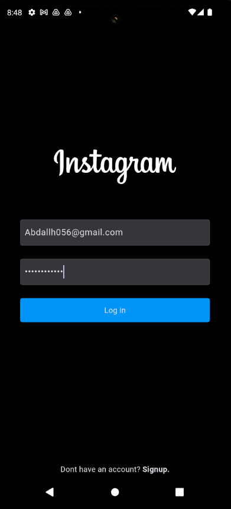
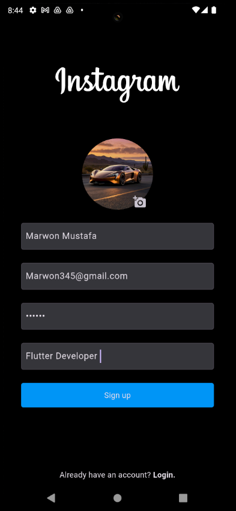
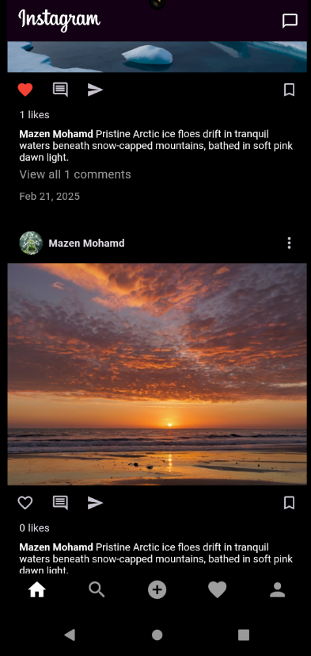
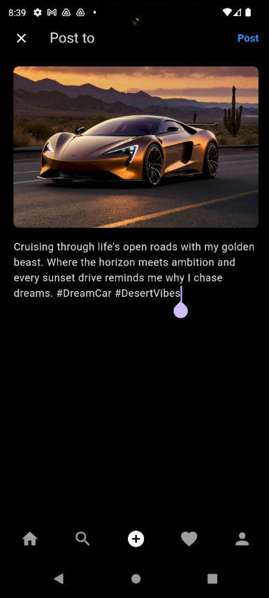
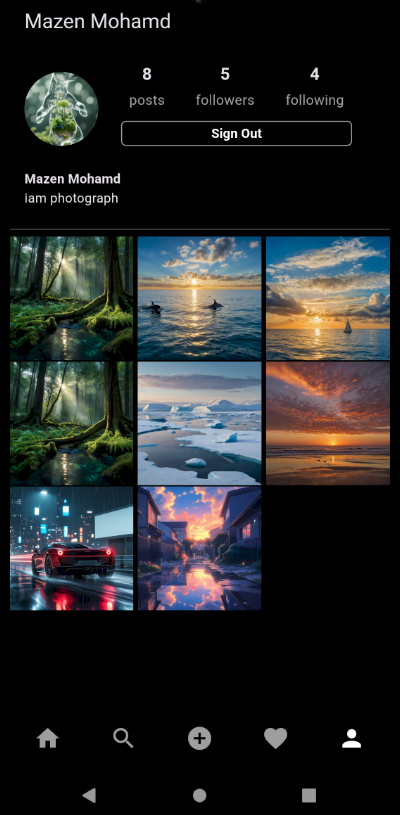
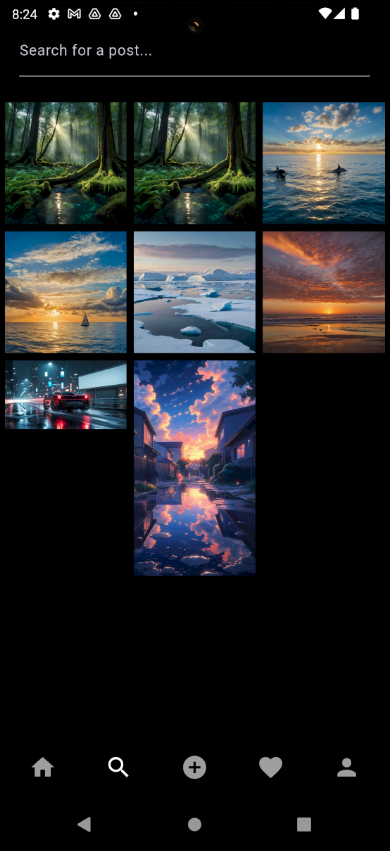

# 📸 Instagram Clone  
A social media application replicating core Instagram features with modern UI/UX using **Flutter** and **Firebase**.

 <!-- Replace with actual demo video -->

## ✨ Key Features
- **User Authentication** 🔑
  - Email/Password Login
  - New User Signup
  - Profile Management

- **Social Interactions** 💬
  - Create/View Posts with Captions
  - Add Comments & Likes
  - Follow/Unfollow Users

- **Content Discovery** 🔍
  - Search Posts & Users
  - Explore Feed
  - Hashtag Support (#DreamCar #DesertVibes)

- **Profile Management** 👤
  - Edit Bio & Profile Info
  - Track Posts Count
  - View Followers/Following

- **Responsive UI** 📱
  - Clean Modern Design
  - Adaptive Layouts
  - Smooth Animations

## 📸 Screenshots

  
  
  
  
  
  
  

## 🛠️ Tech Stack
- **Frontend**:  
    
  

- **Backend**:  
    
  

- **Authentication**:  
  

